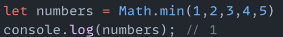

# String
## String ин  текст аст. Ва барои текст нависи дар java script мо се роҳ дорем.

### Якум роҳ ин по воситаи нохунакҳои дутога мебошад ("")
`
let string = "Hello";
`
### Дуюма роҳ ин бо ёрии нохунакҳои яктога аст.
`let text = 'Hello, world'`
### Ва сеюм роҳ ин бо воситаи нохунакҳои чаппа мебошад (яъне backticks). Фарқи ин роҳ аз дигарон бо ин фарқ мекунад ки мо дар даруни ин string метавонем ягон вериэйбли дигарро фарёд кунем.

# Методҳои string
## Ғайр аз ин барои string - ҳо мо методҳо дорем
## Метод чист ? Метод ин блок коде мебошад ки дар даруни худаш логикаи тайёр дорад ва вақте ки мо уро фарёд мекунем кори муайянро иҷро мекунад.

## charAt(). charAt ин методи js барои string мебошад ва барои интихоб кардани ягон хайф аз текст бо истифода аз индексашон мебошад

## at(). at ин мисли методи charAt буда аз charAt бо ин фарқ мекунад ки at ададди манфӣ қабул карда метавонад.

`let txt =  'Hello'; console.log(txt.at(-1)); // 'o'`

## concat(). concat ин методи string мебошад ки барои якҷоя кардани string - бо string - и дигар ёри мерасонад.

## replace(). Ин методи string буда барои ягон текст харф ё дигар аломат аз даруни матн мебошад. Ин метод танҳо як элеметнро аз матн иваз мекунад.

## replaceAll(). Ин методи string мебошад ва аз методи гузашта бо ин фарқ мекнад ки хамаи элеметҳое ки ба элементи мо рои кардаги монанд бошад онхоро иваз меканадю

 ## split(). Ин методи string мебошад ки вобаста бо элементе ки мо рои мекунем бо хамон элемент онҳо ҷудо карда массив мекунад.

 
 ## substring() ин методи string мебошад ки барои гирифтани матн аз як индекси муайян то  як индекси дигар мебошад. Ва минуси ин метод дар ин аст ки ин метод адади манфи қабул карда наметавонад.

 

 ## slice() ҳам мисли методи пешина буда фарқи ин метод дар ин аст ки ин метод адади манфӣ қабул карда метавонад.

## toLowerCase() ин методи string мебошад ки барои хамаи харфхоро хурд кардан лозим аст.

##  toUpperCase() ин баръакси методи гузаштаамон мебошад ки харфхоро калон карда нишон медиҳад

## trim() ин методи string буда барои пробелхои зиёти аз тарафи рост ва чапи матн ёр  мерасонад.

## includes() ин методи string буда барои ёфтани ягон элемент аз матн мебошад. Ва дар ҷавобаш ба мо true ё false медиҳад.

## toString() ин методи string буда барои ба матн гардонидани ягон элемет мебошад.

## indexOf() ин метод барои ёфтани индекси ягон элемент мебошад.

## repeat() ин метод барои такрор кардани ягон матн якчанд маротиба
 

## Методҳои number.
## Math.floor() Ин методи number буда барои рақамро бутун кардан мебошад. Ин метод агар ракам 1.1, 1.2, 1.5, 1.8... бошад онро гирифта 1 холи мекунад яъне хурди бутун мекунад

## Math.round() Ин методи number буда барои рақамро бутун кардан мебошад. Ин метод агар ракам 1.1-1.4 аз хурдаш мегирад ва агар аз    1,5 зиёд бошад аз бутуни оянда мегирад.

## Math.ceil()Ин методи number буда барои рақамро бутун кардан мебошад. Ин метод агар ракам хамин ки аздаҳдор шуд уро ба бутун ояндааш табдил медиҳад

## max() барои аз байни рақамҳо калонтаринашонро ёфтан мебошад

## min() барои аз байн  ракамхо хурдтариашро гирифтан мебошад.

## pow() барои ба дарача бардоштани ракам мебошад

## sqrt() барои решаи квадратии ракамрои ёфтан мебошад

## abs() барои адади манфиро мусбат кардан мебошаd

## random() барои адади номуайянрои гирифтан лозим аз

## isNaN() Хама гуна элемент ғайр аз рақам NaN ҳастан яъне рақам нестанд ва агар элемент рақам набошад онро методи мо ёфта ба мо true нишон медиҳад агар наёфт ба мо false нишон медиҳад

